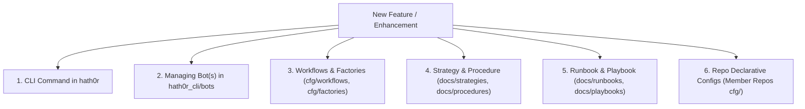

# CR-CLI-FEATURE-STANDARD-001: Canonical Rule on CLI-First Shared Features & Artifact Hexad

> **Canonical Rule** · ID: `CR-CLI-FEATURE-STANDARD-001` · Status: **ACTIVE & MANDATORY**  
> Authority: HATH0R OpenSource Group / 1-Nation Suite Control Tower (`Bayly-AI/HATH0R-CLI` / `Bayly-AI/1-Nation-ATC`)

---

## 1. Core Mandate (CRITICAL)

1. **Zero Code Duplication Across Repositories**: Anything that can be used across multiple repositories **MUST live in the CLI (`HATH0R-CLI`)**. Do not duplicate implementation code, helper scripts, evaluation logic, or bot engines across member repositories.
2. **Configuration-Only Member Repositories**: Member repositories (`1N-MCP`, `1N-CMCP`, `UXP`, `ADMIN`, `AgentGuard`, `Ray-AI`, etc.) must only contain the declarative configuration files (`cfg/`, `otel.json`, factory YAMLs, workflow JSONs) required to bind to the tools, bots, and services provided by the CLI.
3. **Mandatory Complete Feature Package**: When adding any new feature or enhancement that qualifies as a CLI capability, agents and developers **MUST** deliver the complete feature package comprising the implementation, managing bots, and the **Governance Documentation Hexad**.

---

## 2. Complete Feature Package Requirements

Every new feature or capability added to the ecosystem must satisfy all 6 dimensions before being declared complete:

### Dimension 1: First-Class CLI Command
- Registered in `src/hath0r_cli/commands/` and `src/hath0r_cli/lazy_group.py`.
- Must provide human-friendly formatted terminal output via `rich.console` or `click`.
- Must provide machine-readable `--json` output mode for headless automation.

### Dimension 2: Managing Autonomous Bot(s)
- Defined in `src/hath0r_cli/bots/`.
- Autonomously executes, monitors, audits, and enforces the health and thresholds of the feature.

### Dimension 3: Workflows & Automation Scripts
- Defined in `cfg/workflows/`, `cfg/docker/workflows/`, or `cfg/factories/`.
- Includes reproducible verification scripts in `scripts/` or `Makefile` entrypoints.

### Dimension 4: Strategy & Procedure
- **Strategy** (`docs/strategies/`): Technical design, architectural rationale, and integration boundaries.
- **Procedure** (`docs/procedures/`): Step-by-step procedural standard for implementing and extending the feature.

### Dimension 5: Runbook & Playbook
- **Runbook** (`docs/runbooks/`): Day-to-day operational execution, status checks, and lifecycle commands.
- **Playbook** (`docs/playbooks/`): Incident triage, quality degradation response, and edge-case resolution.

### Dimension 6: Declarative Repo Configuration
- Consumer repositories contain only configuration (e.g. `cfg/observability/otel.json`, `cfg/factories/*.yaml`).
- Repos invoke CLI commands rather than re-implementing logic.

---

## 3. Enforcement & Verification

- Preflight checks (`hath0r preflight` / CI gates) enforce this policy.
- PRs containing cross-repo logic duplication or missing governance hexad documentation will be blocked at review.
