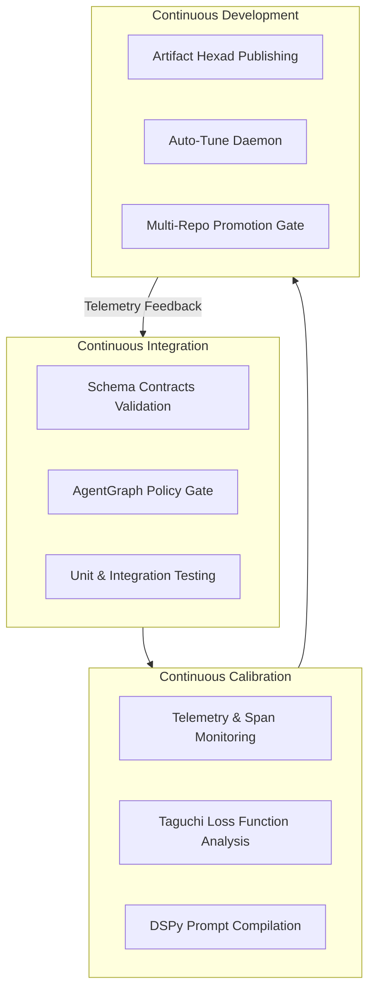

# CICCCD Strategy

> Product: **HATH0R Control Tower** · Subsystem: **Governance & Calibration Engine**  
> Status: **Active Standard** · Updated: 2026-10-04

---

## 1. Overview & Vision

**CICCCD** stands for **Continuous Integration, Continuous Calibration, Continuous Development**. It evolves standard software engineering CI/CD for agentic AI architectures by embedding continuous calibration loops into the operational control plane.

In traditional software, Continuous Integration (CI) and Continuous Deployment (CD) ensure code correctness and delivery. In agentic frameworks, software behavior is dictated not only by procedural code, but also by system prompts, LLM model parameters, dynamic AgentGraph routing topologies, and DSPy compiled signatures.

CICCCD establishes a closed-loop control plane that continuously monitors runtime telemetry, measures parameter drift, calibrates prompts and hyperparameters, and enforces zero-tax quality gates.

---

## 2. Core Pillars

1. **Continuous Integration (CI)**
   - Schema contracts validation (`hath0r contracts validate`).
   - AgentGraph role RBAC and policy graph verification (`hath0r agentgraph validate`).
   - Automated test execution with hard quality gates.

2. **Continuous Calibration (CC)**
   - Entry gate threshold enforcement: Calibration state age must be $\le 24.0\text{ hours}$.
   - Orthogonal Array Testing Strategy (OATS) via Taguchi Methods (`TaguchiLossOptimizer`).
   - Automated prompt optimization and signature compilation using DSPy (`DSPyCompilerBridge`).

3. **Continuous Development & Deployment (CD)**
   - Complete Artifact Hexad documentation publishing.
   - Background auto-tuning daemon monitoring OpenTelemetry (OTEL) and Phoenix spans.
   - Environment promotion pipeline validation (`local` $\rightarrow$ `development` $\rightarrow$ `testing` $\rightarrow$ `staging` $\rightarrow$ `master`).

---

## 3. Key Metrics & Success Criteria

- **Calibration Freshness**: $\le 24\text{h}$ age across all member repositories.
- **Drift Tolerance**: Accuracy drift $\ge -0.01$, latency drift $\le +50\text{ms}$, tokenizer tax drift $\le +0.02$.
- **Contract Integrity**: 100% schema contract compliance across all group products.
