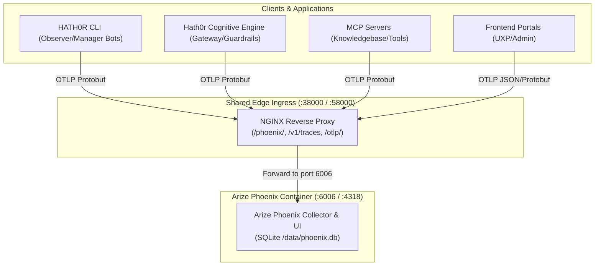

# Arize Phoenix Distributed Telemetry Strategy

> Artifact: **Strategy** · Suite: `hath0r-opensource` / `bayly-ai` / `1-nation`  
> Canonical Standard: `CR-SUBSTRATE-001`, `CR-CICCCD-001`, `CR-CLI-FEATURE-STANDARD-001`  
> Date: 2026-10-05

## 1. Executive Summary

This strategy establishes Arize Phoenix as the unified open-source AI observability, agent tracing, FinOps token-cost accounting, and LLM evaluation platform across all three suites:
1. **Hath0r OpenSource** (`hath0r-framework`, `hathor-cli`, `hath0r-atc`, `hath0r-mcp`)
2. **BaylyAI (BAI)** (`BAI/ATC`, `BAI/MCP`, `BAI/UXP`)
3. **1-Nation** (`1-Nation/ATC`, `1-Nation/MCP`, `1-Nation/C-MCP`, `1-Nation/UXP`, `1-Nation/ADMIN`)

All telemetry adheres strictly to **OpenInference** and **OpenTelemetry (OTel)** semantic conventions over HTTP Protobuf (`v1/traces`).

---

## 2. Architecture & Ingress Topology

---

## 3. Core Telemetry Pillars

### A. Project & Namespace Isolation
Every span and tracer provider MUST attach a distinct project identifier:
- **HTTP Header**: `x-phoenix-project-name: <project_id>`
- **Resource Attribute**: `service.name: <project_id>` and `openinference.project.name: <project_id>`
- Canonical Project IDs:
  - `hath0r-framework`
  - `hath0r-cli`
  - `hath0r-mcp`
  - `1-nation-mcp`
  - `1n-customer-mcp`
  - `bayly-ai-mcp`
  - `agentguard`

### B. Input / Output Capture
All agent reasoning steps, tool calls, and LLM completions capture input/output payloads:
- **LLM Messages**: `llm.input_messages.<index>`, `llm.output_messages.<index>`, `input.value`, `output.value`
- **Tool Invocations**: `tool.name`, `tool.parameters`, `tool.output`
- **Retrievals**: `retrieval.documents.<index>.document.content`, `retrieval.documents.<index>.document.score`

### C. FinOps Cost & Token Attribution
To prevent unbounded LLM inference expenditure:
- All LLM invocations record `llm.model_name`, `llm.token_count.prompt`, `llm.token_count.completion`, and `llm.token_count.total`.
- Explicit cost overrides are recorded in `llm.cost.prompt`, `llm.cost.completion`, and `llm.cost.total` (USD).
- The Phoenix pricing table dynamically cross-checks token usage against official provider rates.

### D. Automated Evals & Quality Gates
Continuous calibration (`CR-CICCCD-001`) streams golden benchmark scores into Phoenix:
- Statutory Faithfulness ($\ge 0.45$)
- Neutrality & Objective Tone ($\ge 0.70$)
- Citizen Readability ($\ge 0.80$)
- Jailbreak & Security Safety ($= 1.00$)
