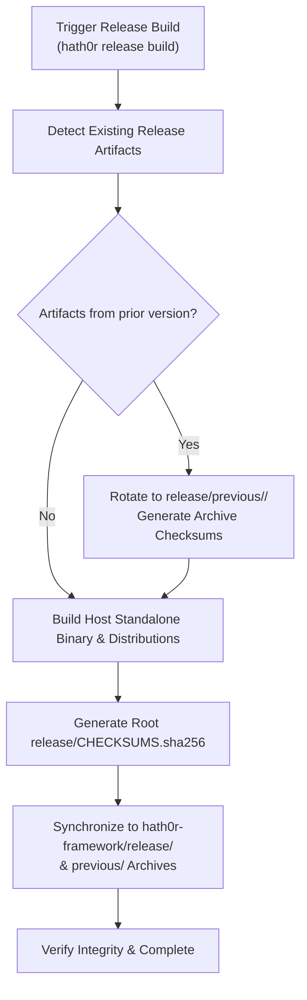

# Strategy: Canonical Release Binaries, Version Archiving & Dual-Repo Synchronization

> Canonical Strategy for HATH0R Suite Release Distribution and Archive Retention  
> Product: `HATH0R-CLI` · Group: `hath0r-opensource` · Issue: #217

---

## 🎯 Executive Summary & Objectives

The Hath0r CLI is distributed as a zero-dependency standalone binary across multiple operating systems and architectures. To enable seamless onboarding, air-gapped deployments, and automated upgrades, both the **HATH0R-CLI** and **HATH0R-Agentic-Framework** repositories maintain synchronized, active `release/` directories with historical version archiving.

### Key Objectives
1. **Canonical `release/` Directory**: Host the active standalone executables (`darwin-arm64`, `darwin-x86_64`, `linux-arm64`, `linux-x86_64`, `windows-x64`), python wheels, tarballs, and fileset packages.
2. **Historical Version Retention (`release/previous/`)**: Archive previous release binaries into version-tagged directories (`release/previous/<version>/`) with self-contained SHA-256 verification manifests.
3. **Dual-Repo Synchronization**: Automate synchronization so building a CLI release updates both `HATH0R-CLI/release/` and `hath0r-framework/release/`.
4. **Cryptographic Integrity**: Guarantee tamper-evident verification via `CHECKSUMS.sha256` generated at build time.

---

## 🏗️ Architecture & Layout

```text
HATH0R-CLI / Framework Root
└── release/
    ├── hath0r-darwin-arm64
    ├── hath0r-darwin-x86_64
    ├── hath0r-linux-arm64
    ├── hath0r-linux-x86_64
    ├── hath0r-windows-x64.cmd
    ├── hath0r_cli-<version>-py3-none-any.whl
    ├── hath0r_cli-<version>.tar.gz
    ├── hath0r-fileset-<version>.tar.gz
    ├── CHECKSUMS.sha256
    ├── README.md
    └── previous/
        ├── README.md
        └── <previous-version>/
            ├── hath0r-darwin-arm64
            ├── hath0r-darwin-x86_64
            ├── ...
            └── CHECKSUMS.sha256
```

---

## 🔄 Lifecycle Workflow



---

## 🛡️ Governance & Invariants

- **Idempotency**: Release rotation must never delete historical releases or overwrite existing archives without explicit flags.
- **Root Cleanliness**: The root `release/` directory must only contain artifacts belonging to the current active release.
- **Cross-Platform Availability**: Builds must generate or preserve standard platform targets (`darwin-arm64`, `darwin-x86_64`, `linux-arm64`, `linux-x86_64`, `windows-x64`).
