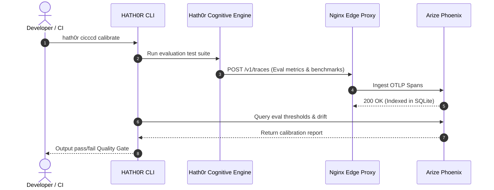

# Arize Phoenix Telemetry Workflow Specification

> Artifact: **Workflow** · Member of **Artifact Hexad** (`CR-CLI-FEATURE-STANDARD-001`)  
> Suite: `hath0r-opensource` / `bayly-ai` / `1-nation`  
> Date: 2026-10-05

## 1. Workflow Summary

The Phoenix Telemetry Workflow coordinates continuous calibration (`CR-CICCCD-001`), live agent tracing, and evaluation feedback loops.

---

## 2. Pipeline Integration Points

1. **Pre-Commit / Local Testing**:
   - `pytest tests/unit/test_phoenix_observability.py`
   - Validates that tracer provider successfully generates OTLP payload without network errors.
2. **CI Promotion Gate (`CR-BAI-001`)**:
   - Every promotion from `development` to `testing` executes evaluation suites.
   - Evaluator spans (`StatutoryFaithfulness`, `NeutralityTone`, `CitizenReadability`) are verified against quality gate minimum thresholds.
3. **Production Runtime**:
   - Live client requests route through `AIGatewayClient` with dynamic FinOps token and latency tracking.
