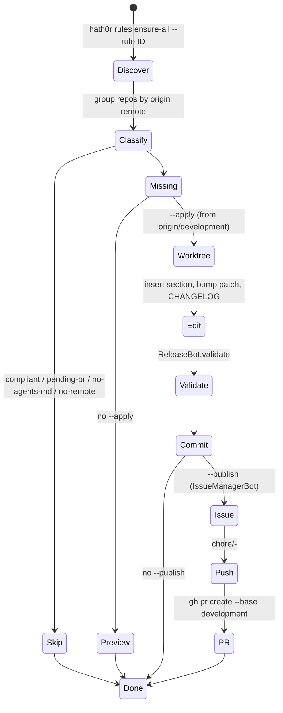

# Workflow: Canonical Rule Rollout

> Canonical Governance Workflow · ID: `WF-RULE-ROLLOUT-001` · Issue: #528

```mermaid
stateDiagram-v2
    [*] --> Discover: hath0r rules ensure-all --rule ID
    Discover --> Classify: group repos by origin remote
    Classify --> Skip: compliant / pending-pr / no-agents-md / no-remote
    Classify --> Missing
    Missing --> Preview: no --apply
    Missing --> Worktree: --apply (from origin/development)
    Worktree --> Edit: insert section, bump patch, CHANGELOG
    Edit --> Validate: ReleaseBot.validate
    Validate --> Commit
    Commit --> Done: no --publish
    Commit --> Issue: --publish (IssueManagerBot)
    Issue --> Push: chore/<issue>-<slug>
    Push --> PR: gh pr create --base development
    PR --> Done
    Skip --> Done
    Preview --> Done
```
