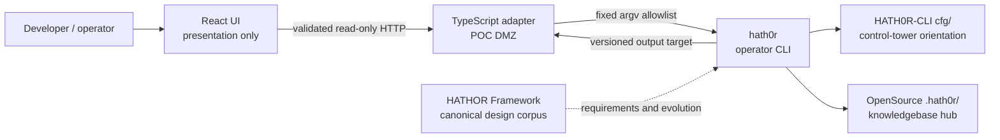

# HATH0R CLI Control-Tower and POC Integration Architecture

## 1. Architecture status

The Python CLI, control-tower configuration, and four read-only operations are
implemented. The POC adapter and structured CLI interface described here are
proposed until their owning repositories contain code and tests.

This architecture applies Framework principles to the OpenSource product; it
does not claim that the Framework's larger design-stage command tree is
available under `hath0r`.

## 2. Objective

Give humans and the POC one mediated path to OpenSource suite orientation
without moving filesystem, process, policy, credential, or promotion authority
into the browser.

## 3. Component responsibilities

### 3.1 React client

- Renders status, products, diagnostics, source, and freshness.
- Treats API data as untrusted until runtime validation succeeds.
- Cannot spawn processes or read host paths, Tower config, KB files, or
  credentials.
- Does not decide that a failed CLI result passed.

### 3.2 TypeScript adapter

- Maps four named operations to immutable argv arrays.
- Spawns `hath0r` directly without a shell.
- Applies deadlines, output caps, concurrency limits, and a minimal
  environment.
- Converts current legacy output or future JSON into the POC response schema.
- Redacts before logging or returning diagnostics.

The adapter is a DMZ and compatibility layer. It is not a second control plane.

### 3.3 HATH0R CLI

- Resolves group-root and KB orientation.
- Verifies the control tower, group policy files, canonical members, and KB
  catalog.
- Emits the suite product catalog through a controlled command.
- Owns the future machine-readable result contract for those operations.

The CLI may read trusted local configuration because it is the local operator
boundary. It must not accept arbitrary paths or commands from the POC.

### 3.4 OpenSource control tower

This repository is the OpenSource control tower. Its `cfg/` files identify:

- group `hath0r-opensource`;
- HATH0R-CLI as the control-tower product;
- Framework and POC as canonical siblings;
- the canonical group knowledgebase;
- the `hath0r` binary; and
- the `.hath0r/` metadata root.

The POC consumes this orientation through the CLI instead of parsing the
files.

### 3.5 HATHOR Framework

The Framework owns the canonical documentation corpus and future platform
contracts: one ingress, structured output, explicit authority planes,
graceful degradation, refusal envelopes, and the application/framework DMZ.

Framework design does not become executable merely because the CLI docs cite
it. A capability crosses into the product only through an implemented,
versioned CLI contract.

### 3.6 Knowledgebase hub

The canonical knowledgebase lives at the OpenSource group hub. Member
repositories retain pointer/stub knowledgebase directories. The CLI mediates
path and catalog access; the POC does not create a copied KB or catalog.

## 4. Trust boundaries

| Boundary | Trust level | Required control |
|----------|-------------|------------------|
| Browser → POC API | Untrusted | Fixed routes, schema validation, no command-shaped fields |
| POC API → CLI | Semi-trusted application code | Named operation map, direct spawn, limits, redaction |
| CLI → environment | Operator-controlled | Only documented environment keys |
| CLI → filesystem/config | Local CLI authority | Fixed suite paths and source validation |
| CLI → KB hub | Group-governed | Canonical hub; member stubs remain pointers |
| Framework docs → implementation | Design input | Source and tests required before capability activation |
| Diagnostics → browser/log | Potentially sensitive | Least detail, path minimization, secret redaction |

The threat model protects the normal integration from cooperative-but-fallible
actors. It is not a sandbox against a malicious process already holding the
developer's filesystem privileges.

## 5. Current request flows

### 5.1 Status

1. POC requests a status view.
2. Adapter runs `hath0r --version`.
3. Adapter runs `hath0r doctor`.
4. Adapter runs `hath0r kb path`.
5. Each result is bounded and classified independently.
6. Process exit is authoritative.
7. Adapter removes raw host paths from the normal response.
8. Browser validates and renders `ok`, `degraded`, or `unavailable`.

The current adapter must not parse Rich table decoration into a stable check
schema.

### 5.2 Product catalog

1. Adapter runs `hath0r kb products`.
2. CLI reads the canonical catalog.
3. Current output is YAML/text.
4. Adapter bounds output and validates any optional normalization.
5. Parse failure is reported, never converted to an empty catalog.

### 5.3 Future structured flow

1. Adapter requests `--output json`.
2. CLI produces `hath0r.cli.response/1`.
3. Adapter validates the CLI schema.
4. Adapter maps CLI data into `hathor-poc.response/1`.
5. Browser validates the POC schema.

The two envelopes have different responsibilities and must not be conflated:
the CLI describes command execution; the POC envelope describes an HTTP
application response.

## 6. Authority and data ownership

| Data | Authority | Derived consumer |
|------|-----------|------------------|
| CLI version | Installed `hath0r-cli` package | POC status |
| Command availability | CLI source/release | CLI docs and POC capability map |
| Tower identity | HATH0R-CLI `cfg/` | CLI output, then POC |
| Suite membership | Tower product catalog | CLI output, then POC |
| Canonical local knowledge | Group KB hub | Future CLI knowledge contracts |
| Framework design | Framework `docs/` | CLI requirements and roadmap |
| Browser display state | POC validated response | React components |
| Fixture state | POC test assets | Tests/demo, always labeled synthetic |

No derived consumer becomes authoritative by caching or reformatting data.

## 7. Failure model

| Failure | CLI/current observation | POC result |
|---------|-------------------------|------------|
| Binary missing | Spawn failure before CLI starts | `unavailable` |
| Doctor exits nonzero | One or more required checks failed | `degraded` |
| KB path missing | Path text may precede nonzero exit | KB unavailable; ignore partial success |
| Product catalog missing | Nonzero exit | Products unavailable |
| YAML malformed | Current CLI prints source text; adapter parser fails | Invalid output, not empty list |
| Timeout/output cap | Adapter terminates process | `error` with bounded remediation |
| Unsupported future command | CLI usage/not-found result | Capability remains unavailable |
| Invalid future JSON schema | Contract rejection | `error`; no legacy guess |
| Framework/Tower service unavailable | No current request-path dependency | Current local reads continue honestly |

## 8. Evolution boundary

A capability moves from Framework design to CLI implementation in this order:

1. issue and interface decision;
2. CLI schema, output, exit, and security contract;
3. CLI implementation and tests;
4. positive and negative consumer fixtures;
5. POC adapter operation and response mapping;
6. browser capability activation; and
7. coordinated documentation/release evidence.

Skipping the CLI stage would create a second public ingress and violate the
architecture.

## 9. Consequences

Positive:

- one controlled local integration seam;
- source-verifiable capability claims;
- no browser filesystem or shell authority;
- deterministic fixtures and graceful degradation; and
- a migration path from text/YAML to structured output.

Costs:

- the POC requires a local server adapter;
- current output needs cautious compatibility handling;
- CLI and POC fixtures must be coordinated; and
- richer Framework capabilities remain unavailable until implemented.

These costs are preferable to screen-scraping becoming a permanent API or the
POC duplicating Tower and Framework logic.
