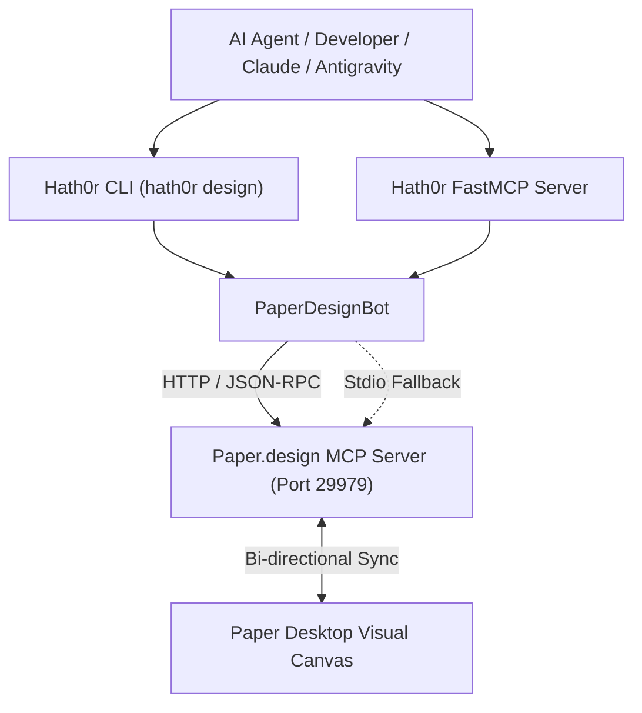

# Paper.design MCP Integration & Website Design Bot Suite

This guide specifies the architecture, CLI commands, FastMCP endpoints, and autonomous bot workflows for **Paper.design** integration within the Hath0r OpenSource ecosystem.

---

## 1. Architectural Architecture

[Paper](https://paper.design) is a web-standards native design tool structured directly around HTML DOM layouts, flexbox auto-layouts, and CSS styling. Its native Model Context Protocol (MCP) server allows AI agents to interact with visual canvases programmatically.

### MCP Topology & Server Registration



### Registry Entry (`cfg/mcp.servers.json`)

```json
{
  "id": "paper-design-mcp",
  "name": "PaperDesignMCP",
  "scope": "tools",
  "group": "design",
  "priority": 4,
  "enabled": true,
  "transport": "streamable-http",
  "base_url": "http://127.0.0.1:29979",
  "mcp_endpoint": "/mcp",
  "health_endpoint": "/health",
  "ready_endpoint": "/ready",
  "command": "/Users/raybayly/.paper/bin/paper",
  "command_args": ["mcp"],
  "description": "Paper.design MCP server for bi-directional canvas-to-code and website design",
  "local_path": "/Users/raybayly/.paper",
  "github": "paper-design/agent-plugins",
  "docs_url": "https://paper.design"
}
```

---

## 2. CLI Command Surface (`hath0r design`)

The `hath0r design` command group provides operators and agents with direct access to canvas tooling:

| Command | Arguments / Options | Description |
|---------|---------------------|-------------|
| `hath0r design status` | `--url <url>` | Check HTTP daemon connectivity (port 29979) and CLI fallback status. |
| `hath0r design inspect` | `--mock <file.json>` | Inspect currently selected artboard, frames, and element tree on canvas. |
| `hath0r design to-code` | `-i <input>`, `-n <name>`, `-f <framework>`, `-o <out>` | Synthesize production-ready React 18 + Tailwind CSS components from canvas/mockup. |
| `hath0r design to-canvas` | `-i <input>`, `-n <name>`, `-w <width>`, `-h <height>` | Format and stage local HTML/React layout into Paper artboard. |
| `hath0r design tokens` | `<input_file>` | Extract color swatches and typography into Tailwind theme & CSS variables. |
| `hath0r design audit` | `<input_file>` | Validate accessibility score, ARIA landmarks, image alt tags, and tap targets. |

---

## 3. Autonomous Bot: `PaperDesignBot`

The `PaperDesignBot` (`src/hath0r_cli/bots/paper_design_bot.py`) encapsulates all domain logic:

1. **`check_connection(timeout=1.5)`**:
   Probes `http://127.0.0.1:29979/mcp` and checks `~/.paper/bin/paper`. Emits structured `PaperConnectionReport` with actionable remediation if offline.
2. **`get_selection()`**:
   Fetches active artboard metadata, viewport dimensions, and child node counts from `paper:get_selection`.
3. **`design_to_code(raw_design, component_name, framework)`**:
   Analyzes semantic structure (navbars, hero sections, cards) and synthesizes clean, accessible TypeScript React components styled with modern Tailwind CSS.
4. **`code_to_design(html_or_jsx, artboard_name, width, height)`**:
   Packs components into responsive canvas preview frames for ingestion via `paper:write_html`.
5. **`extract_tokens(raw_design_or_css)`**:
   Discovers hex/rgb colors, typography stacks, and border radii into `:root` custom properties and Tailwind tokens.
6. **`audit_layout(html_or_code)`**:
   Computes accessibility readiness score (0-100) and detects missing landmark tags or empty interactive controls.

---

## 4. Claude Desktop & FastMCP Server Exposure

Hath0r exposes Paper design capabilities directly to MCP clients:

1. **Auto-registration with Claude Desktop**:
   ```bash
   hath0r mcp serve --install-claude
   ```
   Automatically updates `~/Library/Application Support/Claude/claude_desktop_config.json` with:
   - `hath0r-cli` (FastMCP server)
   - `paper-design-mcp` (Stdio launcher `~/.paper/bin/paper mcp`)
   - `hath0r-mcp` (Cloud knowledge server)

2. **Exposed Tools**:
   - `hath0r_cli(command)`: Execute any Hath0r CLI command.
   - `hath0r_design_status()`: Report live connectivity to Paper Desktop.
   - `hath0r_design_to_code(design_content, component_name, framework)`: Generate code from canvas.

---

## 5. Verification & Testing

Verify the implementation using unit test suites:

```bash
PYTHONPATH=src python3 -m pytest tests/unit/test_paper_design_bot.py
hath0r design status
hath0r design to-code --name HeroSection
```
